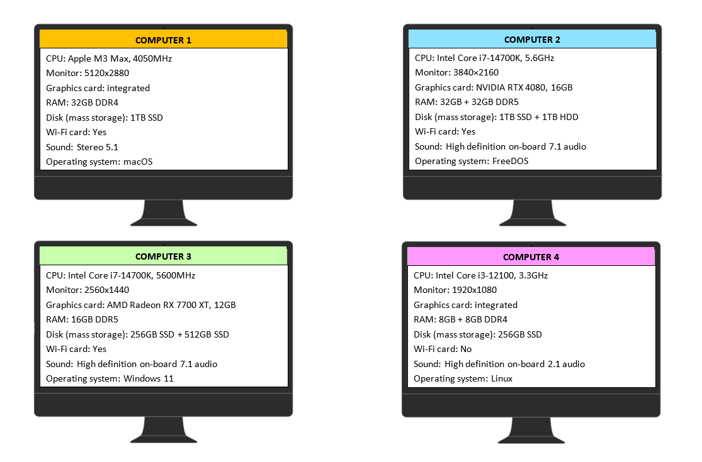

# Quiz: Computer Configuration



```{mchoice}
:answer1: 1;
:answer2: 2;
:answer3: 3;
:answer4: 4;
:correct: 4

Considering the processor, RAM, and graphics card, which computer would be the weakest?
```

```{mchoice}
:answer1: 1;
:answer2: 2;
:answer3: 3;
:answer4: 4;
:correct: 2

Considering the processor, RAM, and graphics card, which computer would be the most powerful?
```

```{mchoice}
:answer1: 1;
:answer2: 2;
:answer3: 3;
:answer4: 4;
:correct: 1

Which monitor has the best resolution?
```

```{mchoice}
:answer1: 1;
:answer2: 2;
:answer3: 3;
:answer4: 4;
:correct: 2

Which computer has the most RAM?
```

```{mchoice}
:answer1: 1;
:answer2: 2;
:answer3: 3;
:answer4: 4;
:correct: 4

Which computer has the worst audio quality?
```

```{mchoice}
:answer1: 1;
:answer2: 2;
:answer3: 3;
:answer4: 4;
:correct: 2,3

Which computer has the fastest processor?
```

```{mchoice}
:answer1: 1;
:answer2: 2;
:answer3: 3;
:answer4: 4;
:correct: 4

Which computer has the least storage capacity?
```

```{mchoice}
:answer1: 1;
:answer2: 2;
:answer3: 3;
:answer4: 4;
:correct: 2

Which computer has the best combination of drives for storing large amounts of data?
```

```{mchoice}
:answer1: 1;
:answer2: 2;
:answer3: 3;
:answer4: 4;
:correct: 4

Which computer cannot connect to a wireless network?
```

```{mchoice}
:answer1: 1;
:answer2: 2;
:answer3: 3;
:answer4: 4;
:correct: 3

Which computer has a Microsoft operating system?
```
