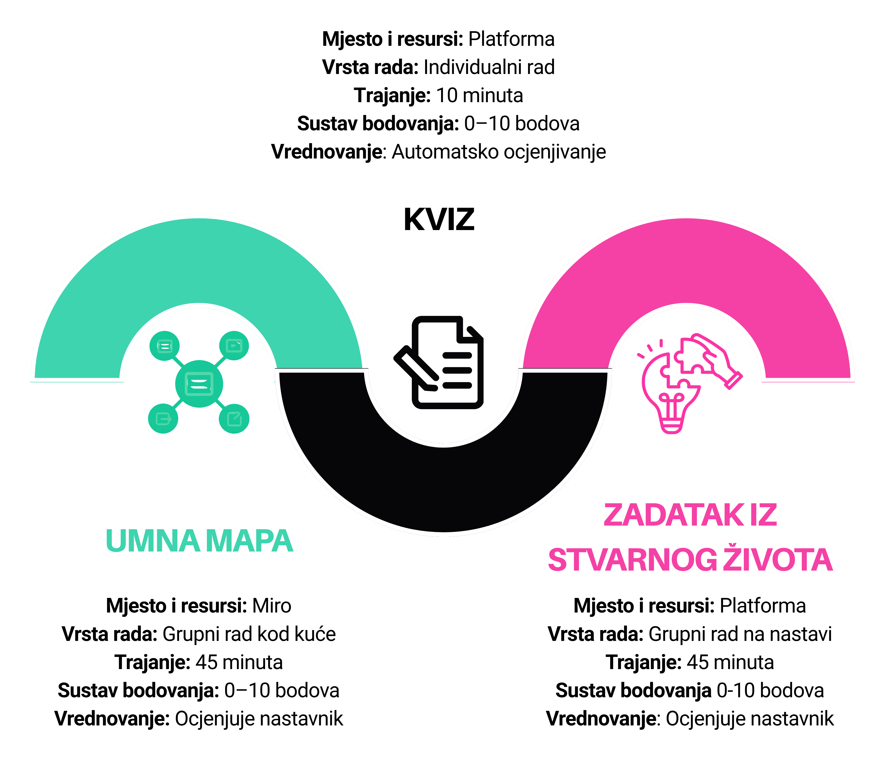

# Lesson Structure

**This lesson has three components:**



At the end of the lesson, each part of your work will be evaluated:

- **Mind map creation** – structure, content, clarity, and collaboration in the group (10 points)

- **Independent task** – accuracy of answers and content understanding in the quiz (10 points)

- **Group work** – contribution to teamwork, reasoning of ideas, and participation in discussion (10 points)


| Final grade | Points |
|-------------|--------|
| Excellent (5) | 27–30 |
| Very good (4) | 23–26 |
| Good (3) | 19–22 |
| Sufficient (2) | 15–18 |
| Insufficient (1) | 0–14 |


```{suggestionnote} 
Your final grade will not depend only on knowledge, but also on the way you participate in the work, collaborate with others, and contribute to a positive working atmosphere within the team. For teamwork to be successful, it is important to follow these collaboration rules:
- All team members are equal and we treat each other with respect.
- We maintain a constructive and positive atmosphere, even when we have different opinions.
- Each member takes responsibility for their contribution and the team's overall result.
- We encourage all members to actively participate in completing the task.
- We try to include all team members in decision-making.
- We consider different ideas and choose the solution that best fits the task.
- We develop ideas together, discuss them, and design final solutions.
- We use time responsibly to complete the task within the scheduled time.
- We monitor the group's progress and agree on next steps.
```

On the next page you will find instructions for creating a mind map.
